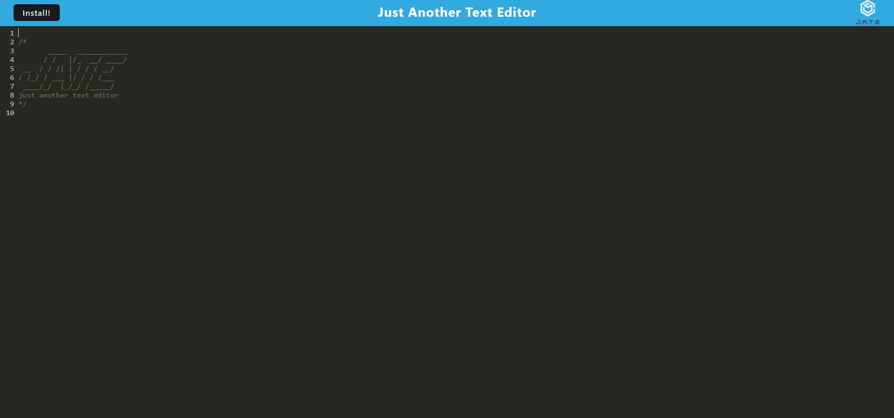

# Just Another Text Editor
## Description
A simple text editor that works in a browser.
Changes text color based on Javascript syntax.

## Usage
- Navigate to [the application at Heroku.](https://immense-crag-37801.herokuapp.com/)
- To save your work, simply click out of the text editor.
- To install the program on Google Chrome, click the install button and follow the prompt.

## Developed by
Webpack, Workbox, and IndexedDB functionality added by [Jacob Brister.](https://github.com/jbrister71)